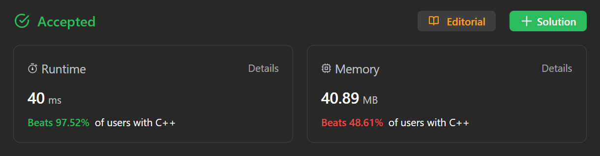
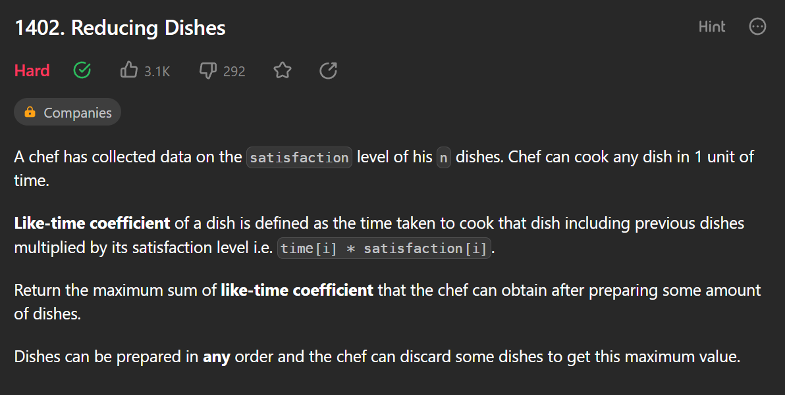
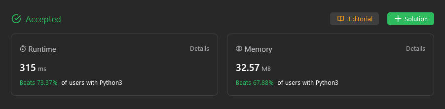

# Exercicios3

**Número da Lista**: 3 
**Conteúdo da Disciplina**: Caminhoneiro, Trocador, Scheduling to Minimize Lateness, Interval Scheduling 

## Alunos

| Matrícula  | Aluno                       |
| ---------- | --------------------------- |
| 21/1029147 | Arthur de Melo Viana        |
| 21/1029666 | Matheus Henrique Dos Santos |

## Sobre

Exercícios resolvidos no Leetcode e no Sphere Online Judge:

| Exercício                                                                                                               | Juiz Online                       |           Autor da Resolução            |
| ----------------------------------------------------------------------------------------------------------------------- | --------------------------------- | :-------------------------------------: |
| [EXPEDI - Expedition](https://www.spoj.com/problems/EXPEDI/)                                                            | [SPOJ](https://www.spoj.com/)     | [Arthur](https://github.com/arthurmlv)  |
| [2178 - Maximum Split of Positive Even Integers](https://leetcode.com/problems/maximum-split-of-positive-even-integers) | [Leetcode](https://leetcode.com/) | [Arthur](https://github.com/arthurmlv)  |
| [1402 - Reducing Dishes](https://leetcode.com/problems/reducing-dishes/)                                                | [Leetcode](https://leetcode.com/) | [Arthur](https://github.com/arthurmlv)  |
| [2136 - Earliest Possible Day of Full Bloom](https://leetcode.com/problems/earliest-possible-day-of-full-bloom/)        | [Leetcode](https://leetcode.com/) | [Matheus](https://github.com/mathonaut) |
| [1383. Maximum Performance of a Team](https://leetcode.com/problems/maximum-performance-of-a-team/)                     | [Leetcode](https://leetcode.com/) | [Matheus](https://github.com/mathonaut) |
| [2141. Maximum Running Time of N Computers](https://leetcode.com/problems/maximum-running-time-of-n-computers/)         | [Leetcode](https://leetcode.com/) | [Matheus](https://github.com/mathonaut) |

## Screenshots

As seções a seguir explicitam os exercícios resolvidos e apresentam uma breve explicação das resoluções. É possível observar o status de conclusão do problema e uma descrição do algoritmo utilizado. A dificuldadade dos exercícios do SPOJ, [de acordo com o próprio site](https://www.spoj.com/tutorials/USERS/#choose), é melhor analisada pela quantidade de usuários que solucionaram e pela taxa de aceitação das submissões, a qual ficou no título de cada seção entre parênteses da seguinte forma: Users - ACC%. Já a dificuldade do leetcode é dada de forma explícita na página do problema.

### EXPEDI - Expedition (2143 - 20.40%)

Utilização do algoritmo do caminhoneiro em C++, modificado para um cenário no qual o tanque do caminhão possui capacidade infinita e cada posto preenche parcialmente o tanque. Para a resolução de tal exercício, deve-se imprimir uma única linha com a menor quantidade de vezes que o caminhão deve ser abastecido para chegar a seu destino. Portanto, a quantidade de vezes que o caminhão foi abastecido foi feita por meio do auxílio de um vetor de visitados. Logo, desde que o tanque tenha combustível para chegar ao posto e não esteja visitado, independente de sua capacidade, o posto será colocado no heap e marcado como visitado. O heap de máximo tem como peso a quantidade de combustível do posto. O vetor de postos foi ordenado para evitar TLE pelas alterações constantes no heap, mas a solução é aceita mesmo sem a ordenação, como pode se analisar nas duas submissões abaixo do enunciado.

### 2178 - Maximum Split of Positive Even Integers (Medium)

O exercício é resolvido por meio de uma adaptação do algoritmo do trocador em C++, visto que é similar na forma como todos os números são múltiplos um dos outros. No entanto, ao invés de escolher os maiores números, escolhe-se os menores para obter a quantidade máxima de números. Caso a soma dos pares ultrapasse a soma final, remove o último do vetor e é somado 2 em cada item do vetor até chegar ao valor da Soma Final.

### 1402 - Reducing Dishes (Hard)

O algoritmo mais similar à resolução é o Scheduling to Minimize Lateness, dado que qualquer troca de valor resulta em perda de satisfação. A solução ambiciosa, que escolhe os maiores valores enquanto a soma deles for positiva, possui sempre o maior valor ofertado para a satisfação. Dado que o maior valor sendo multiplicado pelo maior índice garante a maior satisfação, desde que a soma de todos seja positiva. Para o cálculo, o vetor é ordenado de forma decrescente por meio do std::sort do C++.

### 2136 - Earliest Possible Day of Full Bloom (Hard)

Utiliza a logica do algoritmo _scheduling to minimize lateness_ para a resolução.

### 1383 - Maximum Performance of a Team (Hard)

Utiliza a logica do algoritmo _scheduling to minimize lateness_ para a resolução.

### 2141 - Maximum Running Time of N Computers (Hard)

Utiliza a logica do algoritmo _scheduling to minimize lateness_ para a resolução.

## Instalação

**Linguagens**: C++ e Python 

Para rodar os arquivos em C++, é recomendado utilizar o WSL caso esteja no Windows. Nele, execute os comandos `sudo apt update` e `sudo apt install build-essential` para instalar o g++. O código em C++ também pode ser enviado no próprio [SPOJ](https://www.spoj.com/) ou compilado e executado no [Ideone](https://ideone.com/).

Já para rodar os arquivos em Python, pode ser utilizado o interpretador online [GDB](https://www.onlinegdb.com/) ou instalar o Python na sua máquina (as instruções para instalação podem ser encontradas no [guia de instalação](https://wiki.python.org/moin/BeginnersGuide/Download)).

## Uso

Para os exercícios em C++, compile o código utilizando `g++ -o prog arquivo.cpp` e execute-o utilizando `./prog`, por fim, digite o input no terminal. Também pode ser utilizado o comando `./prog < entrada.txt` caso exista algum caso de teste válido no arquivo de texto. Os links para os problemas resolvidos estão na seção "Sobre", onde podem ser enviados para verificar se foram aceitos.

Para os exercícios em Python, basta digitar `python nome-do-arquivo.py` no terminal de preferência para rodar o código com os casos de testes dados como exemplo. Da mesma forma, a solução pode ser enviada na própria página do problema.

## Vídeo

Para acessar o vídeo explicativo sobre os exercícios, [clique aqui](https://www.youtube.com/embed/).

Para baixar o vídeo, [clique aqui](apresentacao.mp4).
